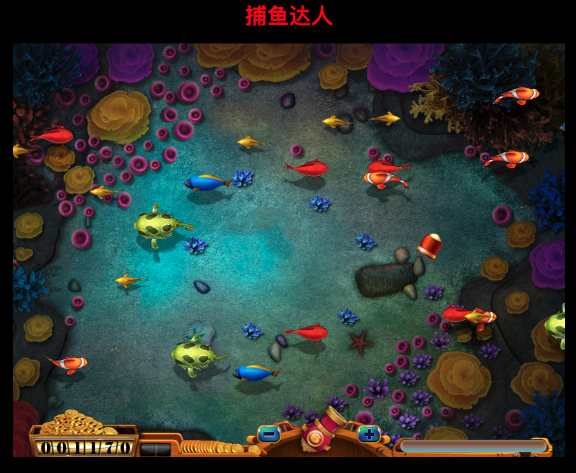
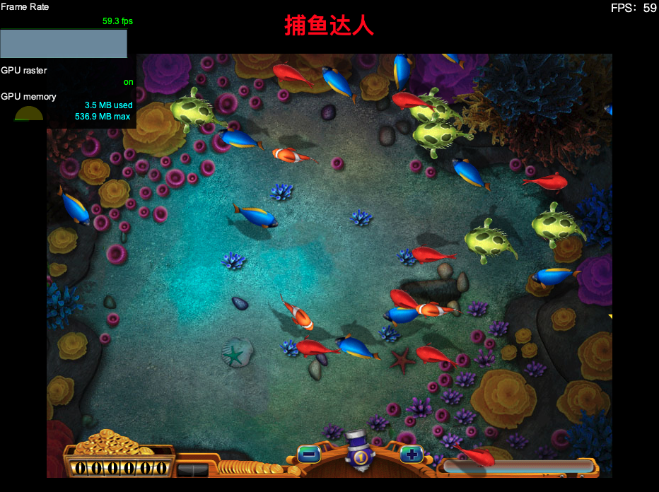
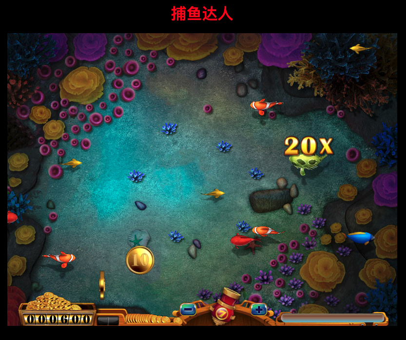

# fishing-joy

捕鱼达人 Canvas 版，使用 TS 开发。

[在线试玩，点击直达](https://xikong1995.github.io/games/fishing-joy/index.html)

## 界面





## 运行

```
// 本地启动
yarn serve

// 打包部署
yarn build
```

## 开发说明

**目录说明：**

```
|-   public          ——资源文件，不参与webpack打包过程
|-   src/config      ——配置文件，全局变量和常量
|-   src/css         ——样式文件
|-   src/images      ——背景图片
|-   src/model       ——动画模型
|-   src/type        ——TS类型声明
|-   src/utils       ——工具函数
|-   src/index.html
|-   src/main.ts     ——主函数（入口文件）
```

**其他说明：**

本代码借鉴其它源码，非原创，仅供学习参考。

## 协议

[MIT](./LICENSE)
